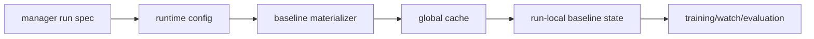

# Baseline Materialization

A baseline is a savestate that starts a run at a specific race target. Training
and evaluation should not replay menu navigation on every episode reset. Instead,
the materializer navigates the emulator once, saves the exact state, and records
metadata that explains what that state represents.

## Ownership

There are two layers of baseline state:

- The global materializer cache stores expensive reusable save states under
  `local/cache/baseline_materializer/`.
- Each managed run stores its own hardlink or copy under
  `local/runs/.../baselines/`.

The run-local file is the manifest used by the manager, archives, exports, and
resume flows. The cache is an optimization. A managed run should be resumable
from its SQLite state and run-local baselines without depending on a cache entry
remaining visible forever.

## Cache Identity

Cache keys include the inputs that can change the bytes or semantics of a
baseline:

- materializer schema version
- mode and course index
- GP difficulty when applicable
- vehicle and source engine setting
- renderer and race-intro timing
- ROM SHA-256 and emulator core SHA-256
- generated-course identity for X-Cup baselines
- baseline variant index and seed for GP grid variants

Paths are intentionally not identity. Moving the same ROM or core should not
invalidate cache entries, but changing bytes at the same path should.

## Non-X-Cup GP Variants

GP race starts can have opponent-grid variation. For fixed courses, those
baseline variants are canonical for `(course, difficulty, vehicle, variant)`;
they are not derived from the managed run seed. This keeps the cache bounded and
lets runs with different training seeds share the same menu-materialized grid
variants.

The run seed still affects training randomness after reset. It should not create
a new set of menu baselines for every run unless the course itself is generated.

## X-Cup Baselines

X-Cup is different because the course layout is generated by the game. Its cache
identity includes the generated-course seed/hash. The generated-course seed is
derived from the run seed, slot, and generation, so X-Cup baselines remain tied
to the run's generated course lifecycle.

## Resume Rules

On resume, the worker restores mutable runtime state from SQLite before training
starts. Existing run-local baselines are reused when their metadata matches the
current schema and cache key. Missing or stale run-local files are republished
from the global cache under a file lock when possible.

Atomic writes use unique temporary filenames. This is important because multiple
workers or materializer paths may publish different baseline files in the same
directory at the same time.

