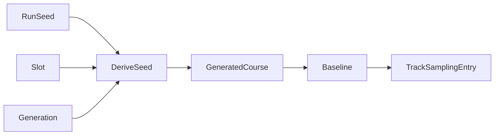

# Generated X-Cup Courses

X-Cup is not a fixed list of tracks. The game generates a course layout from RNG
state after selecting X-Cup. The project models those generated layouts as
runtime course slots.

## Slots

An X-Cup slot is one generated course in the current training pool. The default
generated count is 6 slots and the configured maximum is 128. Each slot has:

- a stable runtime key such as `x_cup_slot_1`
- a slot index
- a generation number
- a generated course id and display name derived from a course hash
- a generated-course seed
- materialized baseline metadata once the savestate exists

The slot key is stable so sampling statistics and UI state can survive rotation.
The generated course id/hash can change when the slot rotates.

## Generation

The generated-course seed is derived from:

- the managed run seed
- the X-Cup generator version
- the X-Cup source course index
- the slot index
- the slot generation

That makes X-Cup reproducible for one run while still allowing independent slots
and later generations.

## Rotation

Rotation is optional runtime behavior. When enabled, a generated slot can be
replaced after enough episodes and sufficient completion. The current defaults
are a completion threshold of 0.9, at least 24 episodes, and an EMA alpha of
0.3 for completion tracking.

Rotation does not mean "X-Cup is six normal courses". It means the training pool
contains generated-course slots. A slot behaves like one course target for
sampling, stats, and engine tuning.

## Persistence

Managed runs persist generated X-Cup slots and materialized artifacts in SQLite.
On resume, the worker restores the latest slot identities and baseline artifact
paths into the runtime config before training continues.

This matters because `train_config.yaml` is only a launch manifest for managed
runs. Mutable generated-course state belongs to the manager DB.

## Evaluation

Evaluation presets should treat X-Cup as a generated-course benchmark only when
the generated-course lifecycle is part of the benchmark. For ordinary fixed
course evaluation, X-Cup should stay out of the fixed 24-course set.

